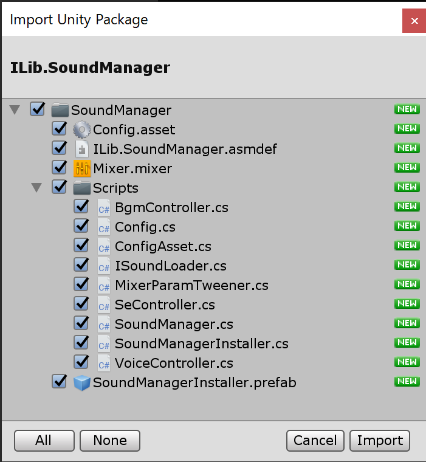
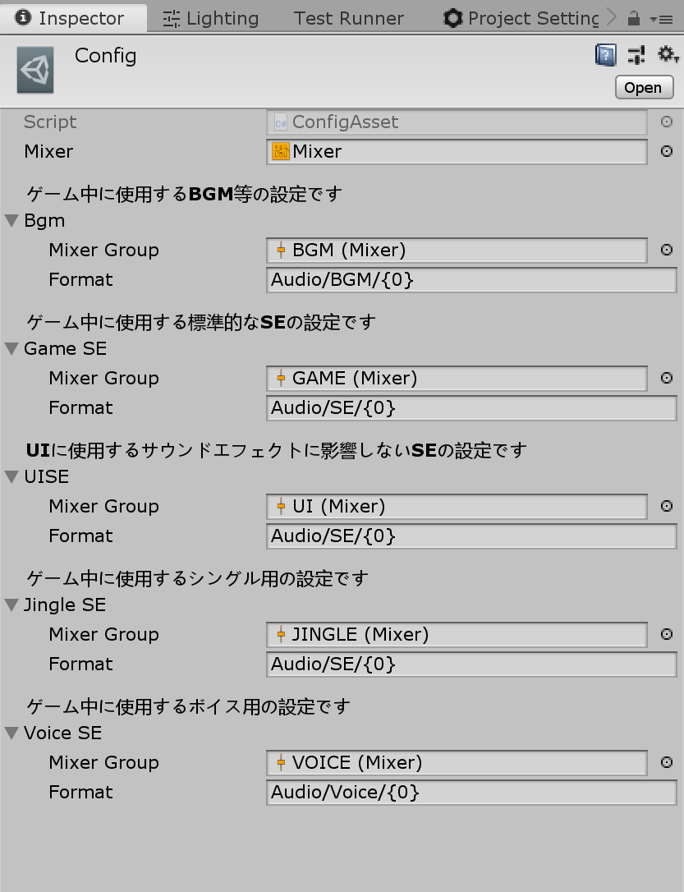
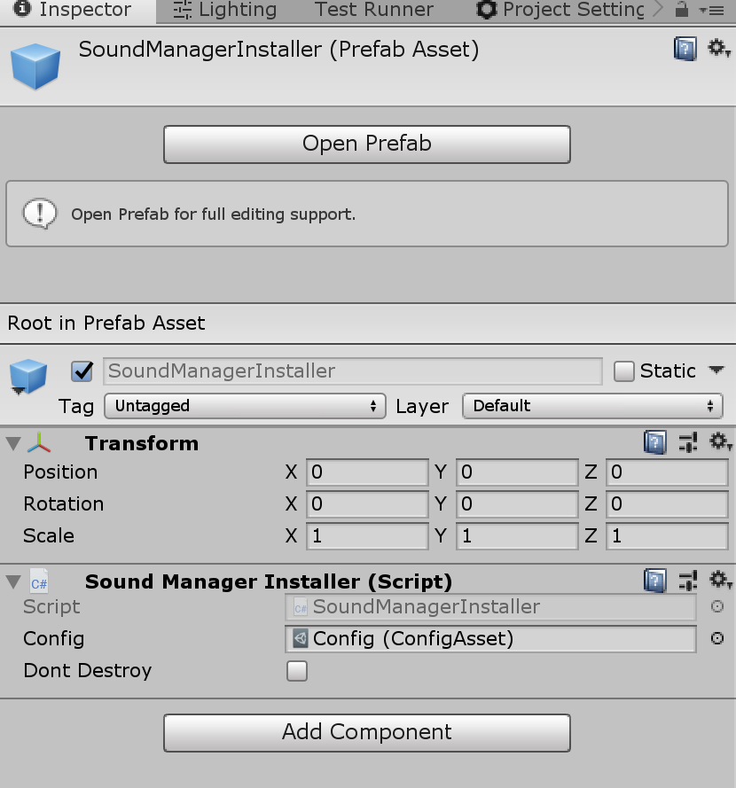
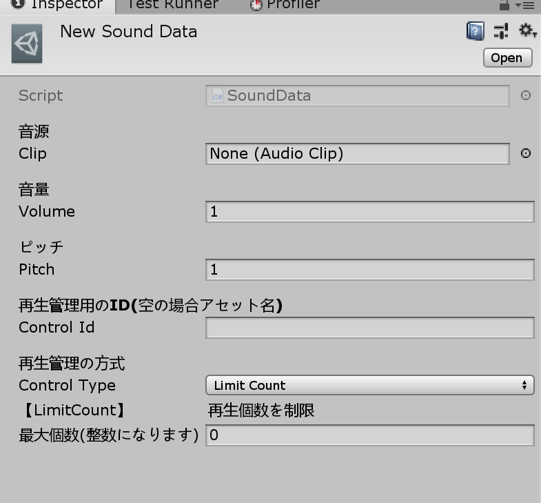

# ILib.SoundManager

ILib Unity SoundManager Package

## 概要

[ilib-sound-control](https://github.com/yazawa-ichio/ilib-sound-control)を利用したサウンドマネージャーのリファレンス実装です。  
読み込み方法のみ拡張できるようになっているため、アセットバンドルを利用して再生する事も可能です。  

## 導入方法

[upm経由](https://yazawa-ichio.github.io/ilib-unity-project/manual/index.html)で[ilib-sound-control](https://github.com/yazawa-ichio/ilib-sound-control)のパッケージを導入してください。  
導入するとメニューに`[Tools/SoundControl/Import SoundManager]`が表示されるのでインポートを実行します。  

 

----

### 設定を行う

インポートした `Assets/SoundManager/Config.asset` を選択します。  
基本的にそのままで使用できる状態になっています。  
`Format` はロードに使用するパスになります。  
`Audio/BGM/{0}` だと `{0}` の部分に再生時に指定したファイル名が入ります。  
デフォルトでは `Resources` フォルダから相対パスになります。

 

### 初期化

`Assets/SoundManager/SoundManagerInstaller.prefab` をシーンに配置するだけで起動が可能です。  
`SoundManagerInstaller` は自身が破棄されると `SoundManager` も自動で破棄します。  
また、`Dont Destroy` にチェックを入れるとシーン遷移で破棄されなくなります。



#### 補足

`ILib.Audio.SoundManager.Initialize` 関数を利用して手動で初期化する事も出来ます。

### サウンドデータ作成する

#### ロードするアセットについて
オーディオの読み取り方法は、Unityの`AudioClip`と専用のデータアセットの`SoundData`・`MusicData`の三種類あります。  
SEは`AudioClip`or`SoundData`、BGMは`AudioClip`or`MusicData`の二種類になります。
指定のロードパスにあるアセットの型で自動的に判断するためコード側で特にどちらを利用しているかを指定をする必要はありません。  

#### AudioClipとSoundDataの違い

`SoundData` を利用すると`Pitch`や`Volume`をデータとして設定出来るほか、簡単な発音制御を指定できます。  
逆にこのような複雑な制御を必要としないのであれば `AudioClip` をそのまま利用するのが一番です。  
`AudioData`を利用しなくても`Pitch`や`Volume`などは実行時に変更できます。  
`MusicData`に関しても概ね同じです。

#### SoundData・MusicDataを作成する

`[Assets/Create/ILib/Audio/SoundData]`・`[Assets/Create/ILib/Audio/MusicData]`で作成できます。  
Configの`Format`指定したパスに作成・配置してください。  
この作業は `AudioClip` をそのまま使う場合は必要ありません。

以下が、`SoundData`のパラメーターです。



> 音源(Clip)  

再生したい`AudioClip`を設定してください。  

> 音量(Volume)　　

音量です。コード上でも音量を指定した場合、この値と乗算されます。

> ピッチ(Pitch)

ピッチです。コード上でも音量を指定した場合、この値と乗算されます。

> 再生管理用のID(Control Id)

後述の再生管理に利用するIDです。  
空の場合は自動でアセット名が設定されますが、同じ管理をしたいサウンドデータがある場合は明示的に指定してください。  

> 再生管理方法

同じ`Control Id`のサウンドデータに対して発音制御が行えます。  
現在、`再生個数を制限`・`再生間隔を制限`・`先勝ち`・`後勝ち` が設定できます。

`MusicData` は音源・音量・ピッチのみ指定でき`SoundData`と同じ内容ため説明を省略します。

## 使用方法

全ての操作は`ILib.Audio.SoundManager`クラスを通して利用します。  

### BGMのロードについて

BGMの音源は再生関数の実行時にロードされます。  
`Resources`から読む場合は十分問題ない速度で読めると想定されるため、事前にキャッシュする機能は今現在ありません。  
拡張して独自のロードを行う場合は、必要に応じて独自ロード側でプリロードを行ってください。

### BGMを再生する

BGMの再生操作は`Change`・`Push`・`Pop`の三つがあります。  
`Push`と`Pop`から分かるようにBGMは全てスタック管理されています。  

> SoundManager.Bgm.Change("BGM_FILE_NAME")

再生されているBGMを停止し、新しいBGMを再生します。  
`clearStack`フラグを有効にすると、詰まれているスタックも全て消してから再生します。  
スタック管理をしない場合、全てChange関数で行ってください。

> SoundManager.Bgm.Push("BGM_FILE_NAME")

再生されているBGMを停止しスタックに積んでから、新しいBGMを再生します。

> SoundManager.Bgm.Pop()

再生されているBGMの再生を停止し、スタックに詰まれているBGMの再生を開始します。  
`startLastPosition`フラグで前回再生を停止した再生位置から再開できます。  


##### 例:メニューのみBGMを変えて、閉じた際に元に戻す場合は以下のようなコードで出来ます。
```csharp
void Prop
{
	// メニューを開く前のBGM
	SoundManager.BGM.Change("NORMAL_BGM");
	// メニューを開く
	Menu.Open();
	// NORMAL_BGMかMENU_BGMに切り替わる
	SoundManager.BGM.Push("MENU_BGM"); 
	// メニューが閉じられた
	Menu.Close();
	// NORMAL_BGMが再生される
	SoundManager.BGM.Pop();
}
```

#### [MusicPlayConfig](https://github.com/yazawa-ichio/ilib-sound-control/blob/master/Runtime/MusicPlayer/MusicPlayConfig.cs)

再生時に `MusicPlayConfig` を渡すことでより細かい再生指示を行えます。

https://github.com/yazawa-ichio/ilib-sound-control/blob/master/Runtime/MusicPlayer/MusicPlayConfig.cs

### SEを再生する

### SEのロードについて

SEに関しては事前にロードしてキャッシュを作ることが出来ます。  
キャッシュがない場合はロードしてから再生されます。  
この遅延ロード再生の機能は便利ですが、SoundManager側では遅延ロード時は一切キャッシュをしない実装になっているため毎回ロード処理が走ります。  
基本的に利用するSEは事前に`SoundManager.Se.AddCache`関数等でキャッシュを作成してください。

#### 補足
SoundPlayer側の実装で遅延ロード時にキャッシュする機能自体はあります。  
そのため、SoundMangerのコードを一部変更すれば遅延ロード時にキャッシュを持つ挙動に変えることが可能です。  
デフォルトで有効になっていない理由は、初心者が解放を明示的に行わず気づかぬままにメモリが肥大化するのを避けるためです。  

### SEを再生する

#### SEの種類

SEの種類としてGame・UI・Jingleの三つを用意してあります。  
それぞれ以下の用途で使います。

> Game

ゲーム用の通常のSEです。Jingleの再生時にダッキングの影響を受けます。

> UI

UI用のSEです。ダッキング等の影響を受けません。

> Jingle

特別なSEです。レベルアップの効果音などに使います。  
再生時にダッキングによってGameとBGMに影響を与えます。  

#### 再生関数について

> SoundManager.Se.Play

Game用のSEを再生します。

> SoundManager.Se.PlayHandle

Game用のSEを再生します。  
返り値の`IPlayingSoundContext`から音量・ピッチの変更やフェードイン・アウトなどの操作が出来ます。

> SoundManager.Se.PlaySeFromUI

UI用のSEを再生します。

> SoundManager.Se.PlayJingle

Jingle用のSEを再生します。  
返り値の`IPlayingSoundContext`から音量・ピッチの変更やフェードイン・アウトなどの操作が出来ます。

## 拡張方法

### ロードの方法を変更する

`SoundManagerInstaller`のゲームオブジェクトに`ILib.Audio.SoundManagement.ISoundLoader`が実装された`Component`があった場合、SoundManagerは`ISoundLoader`経由でロードを行います。  
以下のようなスクリプトを`SoundManagerInstaller.prefab`に`AddComponent`しておくとロード方法を変更できます。

```csharp
using System;
using UnityEngine;
using ILib.Audio;
using ILib.Audio.SoundManagement;

namespace App.Audio
{
	public class SoundLoader : MonoBehaviour, ISoundLoader
	{
		public bool LoadMusic(string path, Action<MusicInfo, Exception> onLoad)
		{
			//独自のローダー
			ResourceLoader.Load(path,(MusicData data, Exception ex) => 
			{
				onComplete?.Invoke(data?.CreateMusic() ?? null, ex);
			});
		}

		public bool LoadSound(string path, Action<SoundInfo, Exception> onLoad)
		{
			//独自のローダー
			ResourceLoader.Load(path,(SoundData data, Exception ex) => 
			{
				onComplete?.Invoke(data?.CreateMusic() ?? null, ex);
			});
		}

		public bool LoadVoice(string path, Action<SoundInfo, Exception> onLoad)
		{
			//独自のローダー
			ResourceLoader.Load(path,(AudioClip clip, Exception ex) => 
			{
				if (ex != null)
				{
					onComplete?.Invoke(null, ex);
					return;
				}
				SoundInfo info = new SoundInfo();
				info.Clip = clip;
				info.ControlId = path;
				onComplete?.Invoke(info, null);
			});

		}

	}
}
```
